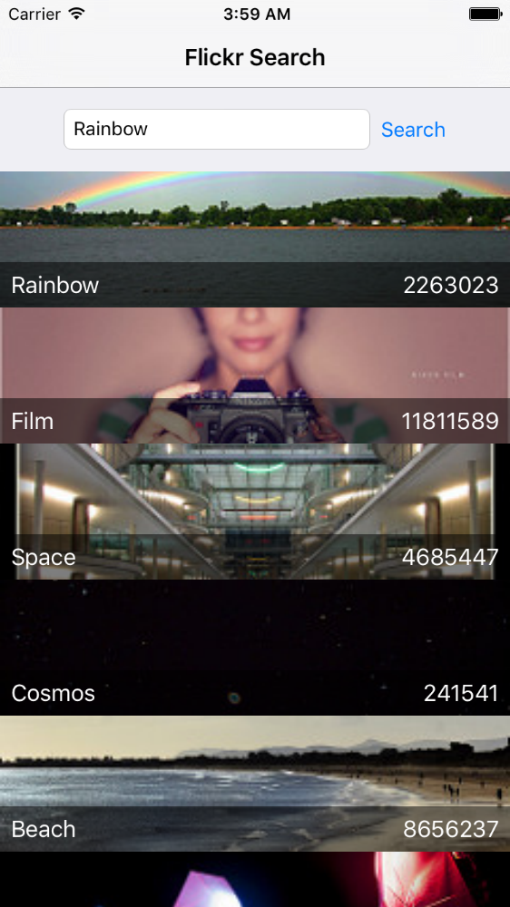

### MVVM Tutorial with Swift 2.1 and ReactiveCocoa-4.0



This is translation of [MVVM Tutorial with Reactive Cocoa](http://www.raywenderlich.com/74106/mvvm-tutorial-with-reactivecocoa-part-1) into `Swift 2.1` and `Reactive Cocoa 4.0.4-alpah-4`.

It also changed 
* `Xib` &rarr; `Storyboard` and `AutoLayout`.
* ViewModel driven navigation &rarr; ViewController driven `Segue`.
* `KVO` signal &rarr; `MutableProperty`.
* `RACCommand` &rarr; `Action`.
* Removed `TableBindingHelper`.

Tested with `Xcode 7.2`.


**You should install `ReactiveCocoa` via [CocoaPod](https://cocoapods.org/) before compile.**

```shell
$ pod install
```

File an issue if any problem.

